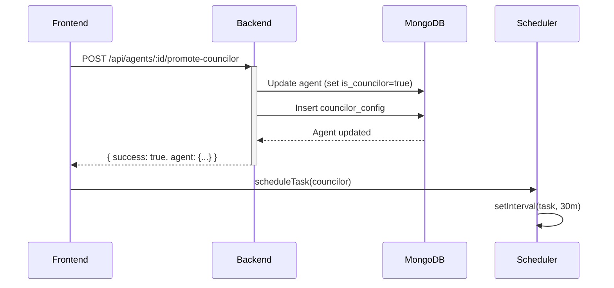
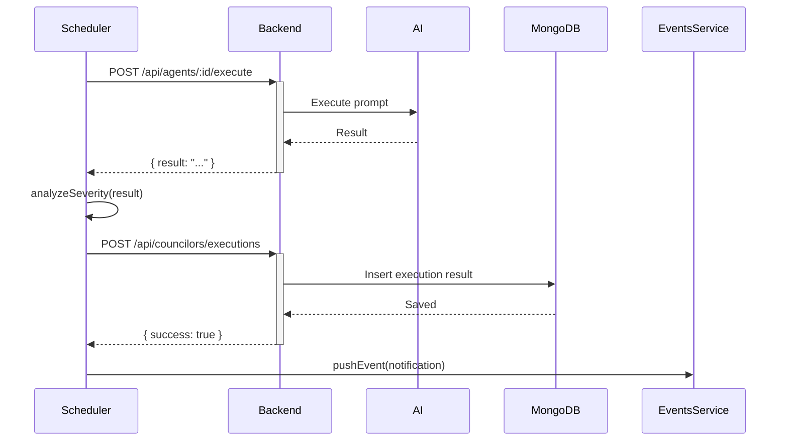
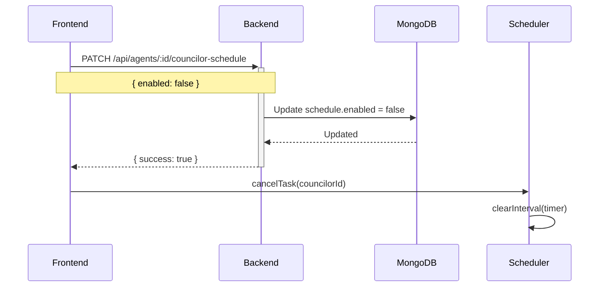

# API Endpoints para Sistema de Conselheiros

Este documento descreve os endpoints de API necessários no backend para suportar o sistema de Conselheiros.

## Visão Geral

Conselheiros são agentes promovidos que executam tarefas automáticas periódicas para monitorar a qualidade do projeto. O sistema requer endpoints para:

1. Promover/demover agentes a conselheiros
2. Configurar/atualizar tarefas periódicas
3. Pausar/retomar execuções
4. Buscar relatórios de execução
5. Persistir resultados de execuções

---

## Endpoints

### 1. Listar Conselheiros Ativos

**GET** `/api/agents?is_councilor=true`

Retorna lista de agentes que foram promovidos a conselheiros.

**Query Parameters:**
- `is_councilor` (boolean, opcional): Filtrar apenas conselheiros (true) ou não-conselheiros (false)

**Response:**
```json
{
  "agents": [
    {
      "_id": "507f1f77bcf86cd799439011",
      "agent_id": "code_generator_agent",
      "name": "Code Generator",
      "title": "Code Generation Agent",
      "emoji": "🏗️",
      "description": "Generates code based on specifications",
      "prompt": "You are a code generation assistant...",
      "model": "claude-3-5-sonnet-20241022",
      "is_councilor": true,
      "councilor_config": {
        "title": "Conselheiro de Arquitetura",
        "schedule": {
          "type": "interval",
          "value": "30m",
          "enabled": true
        },
        "task": {
          "name": "Verificar Arquivos Monolíticos",
          "prompt": "Analise todos os arquivos .ts do projeto...",
          "context_files": ["docs/guidelines.md"],
          "output_format": "checklist"
        },
        "notifications": {
          "on_success": false,
          "on_warning": true,
          "on_error": true,
          "channels": ["panel", "toast"]
        }
      },
      "customization": {
        "enabled": true,
        "display_name": "Silva",
        "avatar_url": null,
        "color": "#667eea"
      },
      "stats": {
        "total_executions": 47,
        "last_execution": "2025-10-25T14:30:00Z",
        "success_rate": 95.7
      }
    }
  ],
  "count": 1
}
```

---

### 2. Promover Agente a Conselheiro

**POST** `/api/agents/:agentId/promote-councilor`

Promove um agente existente a conselheiro, configurando tarefas periódicas.

**URL Parameters:**
- `agentId` (string): ID do agente a ser promovido (ex: "code_generator_agent")

**Request Body:**
```json
{
  "councilor_config": {
    "title": "Conselheiro de Qualidade",
    "schedule": {
      "type": "interval",
      "value": "1h",
      "enabled": true
    },
    "task": {
      "name": "Verificar Cobertura de Testes",
      "prompt": "Execute análise de cobertura de testes...",
      "context_files": ["package.json", "docs/testing-guidelines.md"],
      "output_format": "checklist"
    },
    "notifications": {
      "on_success": false,
      "on_warning": true,
      "on_error": true,
      "channels": ["panel", "toast"]
    }
  },
  "customization": {
    "display_name": "Dra. Testa",
    "avatar_url": null,
    "color": "#10b981"
  }
}
```

**Response:**
```json
{
  "success": true,
  "message": "Agent promoted to councilor successfully",
  "agent": {
    "_id": "507f1f77bcf86cd799439011",
    "agent_id": "test_runner_agent",
    "is_councilor": true,
    "councilor_config": { /* ... */ },
    "customization": { /* ... */ }
  }
}
```

**Status Codes:**
- `200 OK`: Promoção bem-sucedida
- `404 Not Found`: Agente não encontrado
- `400 Bad Request`: Configuração inválida
- `409 Conflict`: Agente já é conselheiro

---

### 3. Atualizar Configuração do Conselheiro

**PATCH** `/api/agents/:agentId/councilor-config`

Atualiza a configuração de um conselheiro existente.

**URL Parameters:**
- `agentId` (string): ID do agente conselheiro

**Request Body:**
```json
{
  "schedule": {
    "value": "2h",
    "enabled": true
  },
  "task": {
    "prompt": "Novo prompt atualizado..."
  },
  "notifications": {
    "on_success": true
  }
}
```

**Response:**
```json
{
  "success": true,
  "message": "Councilor configuration updated",
  "agent": { /* agente atualizado */ }
}
```

**Status Codes:**
- `200 OK`: Atualização bem-sucedida
- `404 Not Found`: Agente não encontrado ou não é conselheiro
- `400 Bad Request`: Dados inválidos

---

### 4. Pausar/Retomar Agendamento do Conselheiro

**PATCH** `/api/agents/:agentId/councilor-schedule`

Pausa ou retoma o agendamento automático de tarefas.

**URL Parameters:**
- `agentId` (string): ID do agente conselheiro

**Request Body:**
```json
{
  "enabled": false
}
```

**Response:**
```json
{
  "success": true,
  "message": "Schedule paused",
  "schedule": {
    "type": "interval",
    "value": "30m",
    "enabled": false
  }
}
```

**Status Codes:**
- `200 OK`: Status atualizado
- `404 Not Found`: Agente não encontrado

---

### 5. Demover Conselheiro

**DELETE** `/api/agents/:agentId/demote-councilor`

Remove o status de conselheiro de um agente, cancelando todas as tarefas agendadas.

**URL Parameters:**
- `agentId` (string): ID do agente conselheiro

**Response:**
```json
{
  "success": true,
  "message": "Agent demoted from councilor",
  "agent": {
    "_id": "507f1f77bcf86cd799439011",
    "agent_id": "code_generator_agent",
    "is_councilor": false
    // councilor_config removido
  }
}
```

**Status Codes:**
- `200 OK`: Remoção bem-sucedida
- `404 Not Found`: Agente não encontrado
- `400 Bad Request`: Agente não é conselheiro

---

### 6. Salvar Resultado de Execução

**POST** `/api/councilors/executions`

Salva o resultado de uma execução de tarefa de conselheiro.

**Request Body:**
```json
{
  "execution_id": "exec_1234567890",
  "councilor_id": "code_generator_agent",
  "started_at": "2025-10-25T14:00:00Z",
  "completed_at": "2025-10-25T14:00:05Z",
  "status": "completed",
  "severity": "warning",
  "output": "Encontrados 3 arquivos com mais de 500 linhas:\n1. screenplay.service.ts (1200 linhas)\n2. agent-game.component.ts (2135 linhas)\n3. screenplay-interactive.component.ts (1850 linhas)",
  "error": null,
  "duration_ms": 5000
}
```

**Response:**
```json
{
  "success": true,
  "message": "Execution result saved",
  "execution": {
    "_id": "507f1f77bcf86cd799439099",
    "execution_id": "exec_1234567890",
    "councilor_id": "code_generator_agent",
    "started_at": "2025-10-25T14:00:00Z",
    "completed_at": "2025-10-25T14:00:05Z",
    "status": "completed",
    "severity": "warning",
    "output": "...",
    "duration_ms": 5000
  }
}
```

**Status Codes:**
- `201 Created`: Resultado salvo
- `400 Bad Request`: Dados inválidos

---

### 7. Buscar Relatórios de um Conselheiro

**GET** `/api/agents/:agentId/councilor-reports`

Retorna histórico de execuções e relatório agregado de um conselheiro.

**URL Parameters:**
- `agentId` (string): ID do agente conselheiro

**Query Parameters:**
- `limit` (number, opcional): Número máximo de execuções recentes (padrão: 10)

**Response:**
```json
{
  "report": {
    "councilor_id": "code_generator_agent",
    "councilor_name": "Silva",
    "recent_executions": [
      {
        "execution_id": "exec_1234567890",
        "started_at": "2025-10-25T14:00:00Z",
        "completed_at": "2025-10-25T14:00:05Z",
        "status": "completed",
        "severity": "warning",
        "output": "Encontrados 3 arquivos...",
        "duration_ms": 5000
      }
    ],
    "total_executions": 47,
    "success_rate": 95.7,
    "next_execution": "2025-10-25T14:30:00Z"
  }
}
```

**Status Codes:**
- `200 OK`: Relatório encontrado
- `404 Not Found`: Conselheiro não encontrado

---

### 8. Buscar Última Execução

**GET** `/api/agents/:agentId/councilor-reports/latest`

Retorna apenas a última execução de um conselheiro (para exibição rápida).

**URL Parameters:**
- `agentId` (string): ID do agente conselheiro

**Response:**
```json
{
  "execution": {
    "execution_id": "exec_1234567890",
    "councilor_id": "code_generator_agent",
    "started_at": "2025-10-25T14:00:00Z",
    "completed_at": "2025-10-25T14:00:05Z",
    "status": "completed",
    "severity": "warning",
    "output": "Encontrados 3 arquivos monolíticos...",
    "duration_ms": 5000
  }
}
```

**Status Codes:**
- `200 OK`: Última execução encontrada
- `404 Not Found`: Nenhuma execução encontrada

---

## Schema MongoDB

### Collection: `agents`

Extensão do schema existente para incluir campos de conselheiro:

```javascript
{
  "_id": ObjectId("507f1f77bcf86cd799439011"),
  "agent_id": "code_generator_agent", // ID único do agente
  "name": "Code Generator",
  "title": "Code Generation Agent",
  "emoji": "🏗️",
  "description": "Generates code based on specifications",
  "prompt": "You are a code generation assistant...",
  "model": "claude-3-5-sonnet-20241022",

  // NOVOS CAMPOS - Conselheiros
  "is_councilor": false, // Indica se é conselheiro
  "councilor_config": { // Presente apenas se is_councilor = true
    "title": "Conselheiro de Arquitetura",
    "schedule": {
      "type": "interval", // "interval" ou "cron"
      "value": "30m", // "30m", "1h", "2h" ou expressão cron
      "enabled": true
    },
    "task": {
      "name": "Verificar Arquivos Monolíticos",
      "prompt": "Analise todos os arquivos .ts...",
      "context_files": ["docs/guidelines.md"], // Opcional
      "output_format": "checklist" // "summary", "detailed", "checklist"
    },
    "notifications": {
      "on_success": false,
      "on_warning": true,
      "on_error": true,
      "channels": ["panel", "toast", "email"]
    }
  },

  // Personalização (já existe, mas pode ser usado para conselheiros)
  "customization": {
    "enabled": true,
    "display_name": "Silva",
    "avatar_url": null,
    "color": "#667eea"
  },

  // Estatísticas
  "stats": {
    "total_executions": 47,
    "last_execution": ISODate("2025-10-25T14:30:00Z"),
    "success_rate": 95.7
  },

  "created_at": ISODate("2025-10-01T10:00:00Z"),
  "updated_at": ISODate("2025-10-25T14:30:00Z")
}
```

### Collection: `councilor_executions`

Nova collection para armazenar histórico de execuções de conselheiros:

```javascript
{
  "_id": ObjectId("507f1f77bcf86cd799439099"),
  "execution_id": "exec_1234567890",
  "councilor_id": "code_generator_agent", // Referência ao agent_id
  "started_at": ISODate("2025-10-25T14:00:00Z"),
  "completed_at": ISODate("2025-10-25T14:00:05Z"),
  "status": "completed", // "running", "completed", "error"
  "severity": "warning", // "success", "warning", "error"
  "output": "Encontrados 3 arquivos com mais de 500 linhas:\n1. screenplay.service.ts (1200 linhas)\n2. agent-game.component.ts (2135 linhas)\n3. screenplay-interactive.component.ts (1850 linhas)",
  "error": null, // Mensagem de erro se houver
  "duration_ms": 5000,
  "created_at": ISODate("2025-10-25T14:00:05Z")
}
```

**Índices recomendados:**
```javascript
db.councilor_executions.createIndex({ "councilor_id": 1, "started_at": -1 });
db.councilor_executions.createIndex({ "execution_id": 1 }, { unique: true });
db.agents.createIndex({ "is_councilor": 1 });
```

---

## Fluxo de Implementação

### 1. Promoção de Agente



### 2. Execução Periódica



### 3. Pausar Conselheiro



---

## Considerações de Segurança

1. **Validação de Prompt**: Validar que prompts não contenham comandos maliciosos
2. **Rate Limiting**: Limitar frequência de criação/atualização de conselheiros
3. **Autenticação**: Apenas usuários autenticados podem gerenciar conselheiros
4. **Autorização**: Verificar permissões antes de promover/demover agentes
5. **Sanitização**: Sanitizar outputs antes de salvar no banco

---

## Notas de Implementação

### Backend (Python)

```python
# Exemplo de estrutura de rota em FastAPI

@router.post("/api/agents/{agent_id}/promote-councilor")
async def promote_to_councilor(
    agent_id: str,
    request: PromoteToCouncilorRequest,
    db: Database = Depends(get_database)
):
    """Promove um agente a conselheiro"""

    # Buscar agente
    agent = await db.agents.find_one({"agent_id": agent_id})
    if not agent:
        raise HTTPException(status_code=404, detail="Agent not found")

    # Verificar se já é conselheiro
    if agent.get("is_councilor"):
        raise HTTPException(status_code=409, detail="Agent is already a councilor")

    # Validar configuração
    validate_councilor_config(request.councilor_config)

    # Atualizar agente
    update_data = {
        "is_councilor": True,
        "councilor_config": request.councilor_config.dict(),
        "updated_at": datetime.utcnow()
    }

    if request.customization:
        update_data["customization"] = request.customization.dict()

    result = await db.agents.update_one(
        {"agent_id": agent_id},
        {"$set": update_data}
    )

    # Retornar agente atualizado
    updated_agent = await db.agents.find_one({"agent_id": agent_id})

    return {
        "success": True,
        "message": "Agent promoted to councilor successfully",
        "agent": serialize_agent(updated_agent)
    }
```

---

## Testes

### Endpoints a testar:

1. ✅ Promover agente inexistente → 404
2. ✅ Promover agente já conselheiro → 409
3. ✅ Promover com configuração inválida → 400
4. ✅ Promover com sucesso → 200
5. ✅ Atualizar configuração → 200
6. ✅ Pausar/retomar agendamento → 200
7. ✅ Demover conselheiro → 200
8. ✅ Salvar resultado de execução → 201
9. ✅ Buscar relatórios → 200
10. ✅ Buscar última execução → 200

---

## Próximos Passos

1. Implementar endpoints no backend (Python/FastAPI)
2. Criar testes unitários para cada endpoint
3. Implementar scheduler no backend (opcional - pode ser só frontend)
4. Adicionar telemetria para monitorar execuções
5. Implementar sistema de notificações (toast, email)

---

**Data de criação:** 2025-10-25
**Última atualização:** 2025-10-25
**Versão:** 1.0
