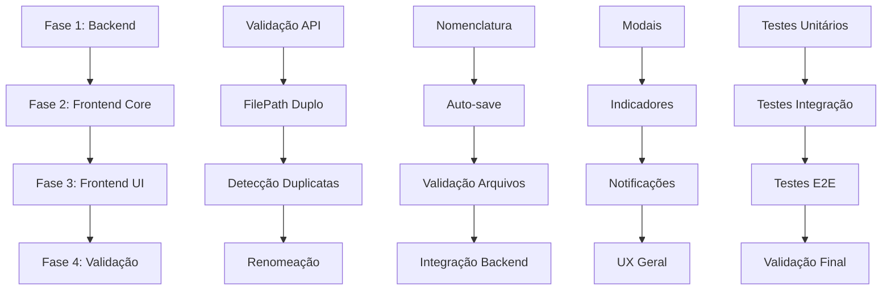

# 🎼 SAGA 001 - FASEAMENTO DETALHADO
## Validação e Melhoria do Fluxo "Criar Novo Roteiro"

---

## 📊 **RESUMO EXECUTIVO**

**Saga**: SAGA-001  
**Título**: Validação e Melhoria do Fluxo "Criar Novo Roteiro"  
**Duração Total Estimada**: 34 horas (4-5 dias de trabalho)  
**Complexidade**: Média-Alta  
**Riscos**: Baixos (implementação incremental)  

---

## 🎯 **OBJETIVOS PRINCIPAIS**

1. **Validar** implementação atual dos 3 fluxos de criação
2. **Implementar** nomenclatura automática com padrão "Novo Roteiro + data"
3. **Melhorar** gerenciamento de filePath (importPath/exportPath)
4. **Adicionar** auto-save inteligente antes de transições
5. **Implementar** validação rigorosa de arquivos .md
6. **Criar** sistema de detecção de duplicatas por path
7. **Implementar** funcionalidade de renomeação

---

## 📋 **FASES DE IMPLEMENTAÇÃO**

### 🔧 **FASE 1: Backend - Validação e Melhorias da API** 
**Duração**: 8 horas | **Prioridade**: 1 | **Dependências**: Nenhuma

**Agente**: `backend-executor`  
**Target**: `src/conductor-gateway`

#### Principais Entregas:
- ✅ Validação de arquivos .md
- ✅ Suporte a filePath duplo (importPath/exportPath)
- ✅ Detecção de duplicatas por path
- ✅ Endpoint de renomeação
- ✅ Testes unitários completos

#### Critérios de Sucesso:
- API robusta e validada
- Suporte completo a novas funcionalidades
- Performance mantida ou melhorada
- Compatibilidade com sistema existente

---

### 🎨 **FASE 2: Frontend - Melhorias Core do Sistema**
**Duração**: 12 horas | **Prioridade**: 2 | **Dependências**: Fase 1

**Agente**: `frontend-executor`  
**Target**: `src/conductor-web`

#### Principais Entregas:
- ✅ Nomenclatura automática implementada
- ✅ Auto-save inteligente com debounce
- ✅ Gerenciamento de filePath duplo
- ✅ Validação de arquivos .md
- ✅ Sistema de detecção de duplicatas
- ✅ Funcionalidade de renomeação

#### Critérios de Sucesso:
- Todos os fluxos funcionam perfeitamente
- UX intuitiva e responsiva
- Performance otimizada
- Integração completa com backend

---

### 🎪 **FASE 3: Frontend - Melhorias de Interface e UX**
**Duração**: 6 horas | **Prioridade**: 3 | **Dependências**: Fase 2

**Agente**: `frontend-executor`  
**Target**: `src/conductor-web`

#### Principais Entregas:
- ✅ Modais aprimorados e intuitivos
- ✅ Indicadores visuais de filePath
- ✅ Feedback visual para auto-save
- ✅ Sistema de notificações
- ✅ Melhorias gerais de UX

#### Critérios de Sucesso:
- Interface polida e profissional
- Feedback visual claro e consistente
- Experiência do usuário excepcional
- Acessibilidade adequada

---

### 🧪 **FASE 4: Validação e Testes de Integração**
**Duração**: 8 horas | **Prioridade**: 4 | **Dependências**: Fases 1, 2, 3

**Agente**: `qa-executor`  
**Target**: `src` (integração completa)

#### Principais Entregas:
- ✅ Testes completos de todos os fluxos
- ✅ Validação de nomenclatura automática
- ✅ Testes de auto-save e transições
- ✅ Validação de gerenciamento de filePath
- ✅ Testes de detecção de duplicatas
- ✅ Validação de funcionalidade de renomeação

#### Critérios de Sucesso:
- 100% dos fluxos validados
- Performance dentro dos limites
- Compatibilidade garantida
- Qualidade de código mantida

---

## 🔄 **FLUXO DE EXECUÇÃO**

---

## 📊 **MÉTRICAS DE SUCESSO**

### Funcionalidade (100%)
- [ ] Todos os 3 fluxos de criação funcionam
- [ ] Nomenclatura automática implementada
- [ ] Auto-save funciona corretamente
- [ ] FilePath duplo gerenciado
- [ ] Validação de arquivos .md
- [ ] Detecção de duplicatas
- [ ] Funcionalidade de renomeação

### Performance (95%+)
- [ ] Tempo de resposta < 500ms
- [ ] Auto-save não bloqueia UI
- [ ] Detecção de duplicatas < 1s
- [ ] Carregamento < 2s

### Usabilidade (90%+)
- [ ] Interface intuitiva
- [ ] Feedback visual adequado
- [ ] Mensagens de erro claras
- [ ] Navegação fluida

### Compatibilidade (95%+)
- [ ] Chrome 90+
- [ ] Firefox 88+
- [ ] Safari 14+
- [ ] Edge 90+

---

## ⚠️ **RISCOS E MITIGAÇÕES**

### Riscos Técnicos
- **Quebra de compatibilidade**: Implementação incremental
- **Performance**: Otimizações e benchmarks
- **Complexidade**: Fases bem definidas

### Riscos de UX
- **Confusão do usuário**: Feedback visual claro
- **Perda de dados**: Auto-save robusto
- **Conflitos**: Sistema de resolução

### Riscos de Qualidade
- **Bugs**: Testes abrangentes
- **Regressões**: Validação contínua
- **Inconsistências**: Padrões definidos

---

## 🎯 **PRÓXIMOS PASSOS**

1. **✅ APROVAÇÃO** do faseamento pelo usuário
2. **🚀 INÍCIO** da Fase 1 (Backend)
3. **📊 MONITORAMENTO** do progresso
4. **🔄 VALIDAÇÃO** contínua entre fases
5. **✅ CONCLUSÃO** e documentação final

---

## 📁 **ARQUIVOS DO PLAYBOOK**

- `playbook/playbook.state.json` - Estado atual da saga
- `playbook/001-backend-validation.md` - Plano detalhado backend
- `playbook/002-frontend-core.md` - Plano detalhado frontend core
- `playbook/003-frontend-ui.md` - Plano detalhado frontend UI
- `playbook/004-validation-tests.md` - Plano detalhado de validação
- `playbook/SAGA-001-FASEAMENTO-RESUMO.md` - Este resumo

---

## 🤝 **AGUARDANDO APROVAÇÃO**

**Maestro** está pronto para iniciar a orquestração da Saga 001 assim que você aprovar este faseamento. Cada fase será apresentada individualmente para validação antes da execução.

**Pergunta**: Você aprova este faseamento e gostaria que eu inicie com a Fase 1 (Backend)?