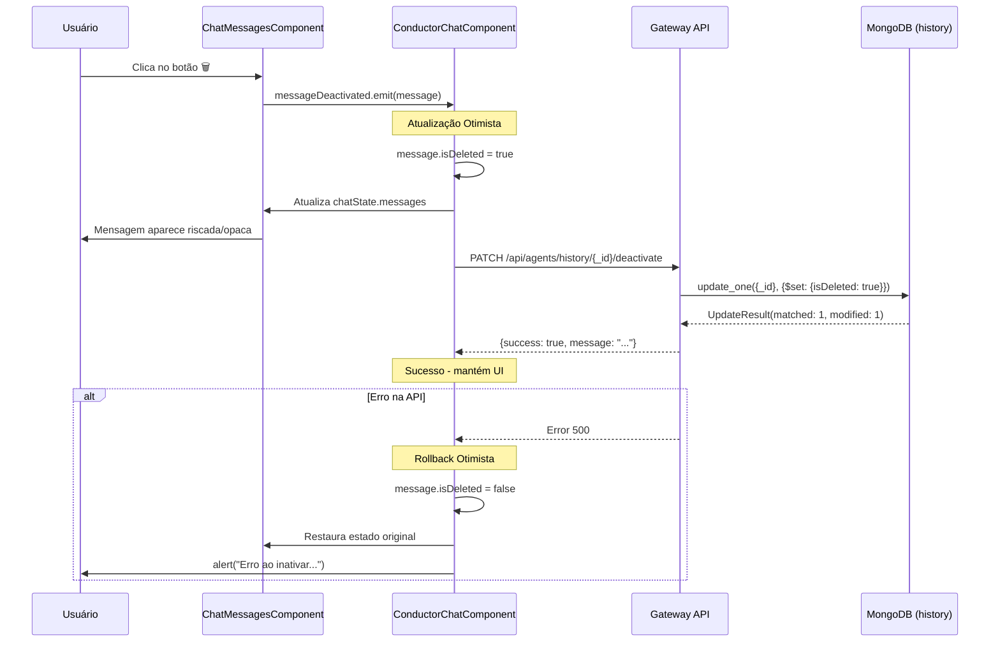

# Requisitos e Plano: Inativar Mensagens do Histórico do Chat

## 📋 Visão Geral

Este documento apresenta uma análise completa e plano de implementação para a funcionalidade de **inativar mensagens do histórico do chat** no Conductor. A necessidade surgiu porque, atualmente, todas as interações entre usuário e agente são incluídas no prompt, mas nem sempre todas as mensagens são relevantes para o contexto. O usuário precisa poder descartar pares input/response que não são precisos ou úteis.

---

## 🎯 Requisitos Identificados

### Requisitos Funcionais

- **RF1**: O sistema deve permitir que o usuário inative (soft delete) um par de mensagens (input do usuário + resposta do agente) do histórico do chat
- **RF2**: Mensagens inativadas não devem ser incluídas na composição do prompt enviado para a LLM
- **RF3**: Mensagens inativadas devem permanecer armazenadas no MongoDB para auditoria, mas marcadas como inativas
- **RF4**: O botão de inativar deve aparecer ao lado do botão de copiar (📋) em cada mensagem do agente
- **RF5**: A interface deve fornecer feedback visual claro quando uma mensagem é inativada
- **RF6**: Mensagens inativadas podem opcionalmente ser exibidas de forma diferenciada (opacidade reduzida, riscado, etc.) ou ocultadas completamente

### Requisitos Não-Funcionais

- **RNF1**: A operação de inativar deve ser instantânea na UI (otimista), com sincronização assíncrona ao backend
- **RNF2**: A modificação deve ser compatível com a arquitetura existente de isolamento de histórico por `instance_id`
- **RNF3**: O sistema deve manter retrocompatibilidade com mensagens antigas (sem o campo `isDeleted`)

---

## 🔄 Análise da Arquitetura Atual

### Fluxo de Dados do Histórico

```
┌─────────────────────────────────────────────────────────────────┐
│                      FLUXO ATUAL DO HISTÓRICO                    │
└─────────────────────────────────────────────────────────────────┘

1. Usuário envia mensagem no chat (conductor-chat.component.ts)
   │
   ├─> Frontend: ConductorChatComponent.sendMessage()
   │   └─> AgentService.executeAgent(agentId, inputText, instanceId, cwd)
   │
2. Frontend → Gateway API: POST /api/agents/{agent_id}/execute
   │
   ├─> Gateway: agents.py:execute_agent()
   │   └─> Monta XML prompt via AgentDiscoveryService.get_full_prompt()
   │       │
   │       └─> PromptEngine.build_xml_prompt(conversation_history, message)
   │           │
   │           ├─> Busca histórico do MongoDB via load_history(agent_id)
   │           │   └─> MongoStateRepository.load_history()
   │           │       └─> db.history.find({"agent_id": agent_id})
   │           │
   │           └─> Formata histórico em XML: _format_history_xml()
   │               └─> Inclui TODAS as mensagens encontradas (sem filtro)
   │
3. Backend: Executa agente com prompt completo
   │
4. Backend: Salva resultado no histórico
   │   └─> MongoStateRepository.append_to_history(agent_id, entry, instance_id)
   │       └─> db.history.insert_one({
   │               "agent_id": agent_id,
   │               "instance_id": instance_id,
   │               "user_input": "...",
   │               "ai_response": "...",
   │               "timestamp": ...,
   │               "_id": uuid.uuid4()
   │           })
   │
5. Frontend: Recebe resposta e adiciona ao histórico local
   │   └─> ConductorChatComponent.chatHistories.set(instanceId, [...history, response])
   │
6. Próxima execução: REPETE desde (1) com histórico acumulado
```

### Componentes Principais

#### **Frontend (Angular)**

| Componente | Caminho | Responsabilidade |
|------------|---------|------------------|
| `ConductorChatComponent` | `src/app/shared/conductor-chat/conductor-chat.component.ts` | Gerencia estado do chat, histórico isolado por agente, envio de mensagens |
| `ChatMessagesComponent` | `src/app/shared/conductor-chat/components/chat-messages/chat-messages.component.ts` | Renderiza lista de mensagens, botão de copiar |
| `AgentService` | `src/app/services/agent.service.ts` | API client, executa agentes, busca contexto |
| `Message` interface | `src/app/shared/conductor-chat/models/chat.models.ts` | Modelo de dados de mensagem |

#### **Backend (Python - Conductor)**

| Componente | Caminho | Responsabilidade |
|------------|---------|------------------|
| `PromptEngine` | `src/core/prompt_engine.py` | Constrói prompts XML/text, formata histórico |
| `MongoStateRepository` | `src/infrastructure/storage/mongo_repository.py` | CRUD de histórico no MongoDB |
| Endpoint `/execute` | `src/api/routes/agents.py` | Executa agente e salva histórico |

#### **Backend (Python - Gateway)**

| Componente | Caminho | Responsabilidade |
|------------|---------|------------------|
| Endpoint `/api/agents/context/{instance_id}` | `src/api/app.py:1673` | Retorna persona, procedimento, histórico e cwd |
| Endpoint `/api/agents/{agent_id}/execute` | (via router agents_router) | Proxy para execução de agentes |

#### **MongoDB Collections**

```javascript
// Collection: history
{
  "_id": "uuid-v4",
  "agent_id": "performance-agent",
  "instance_id": "uuid-da-instancia",
  "user_input": "Analise o código",
  "ai_response": "Aqui está a análise...",
  "timestamp": 1234567890,
  "createdAt": ISODate("2025-11-01T...")
}
```

---

## 🏗️ Arquitetura da Solução Proposta

### Modificação do Schema MongoDB

**Adicionar campo `isDeleted` (boolean) à collection `history`:**

```javascript
// Collection: history (NOVO SCHEMA)
{
  "_id": "uuid-v4",
  "agent_id": "performance-agent",
  "instance_id": "uuid-da-instancia",
  "user_input": "Analise o código",
  "ai_response": "Aqui está a análise...",
  "timestamp": 1234567890,
  "createdAt": ISODate("2025-11-01T..."),
  "isDeleted": false  // ← NOVO CAMPO (default: false)
}
```

**Retrocompatibilidade**: Mensagens antigas sem o campo `isDeleted` serão tratadas como `isDeleted: false` (fallback).

---

### Modificação do Modelo de Dados (Frontend)

**Arquivo**: `src/app/shared/conductor-chat/models/chat.models.ts`

**ANTES:**
```typescript
export interface Message {
  id: string;
  content: string;
  type: 'user' | 'bot' | 'system';
  timestamp: Date;
  isStreaming?: boolean;
}
```

**DEPOIS:**
```typescript
export interface Message {
  id: string;
  content: string;
  type: 'user' | 'bot' | 'system';
  timestamp: Date;
  isStreaming?: boolean;
  isDeleted?: boolean;  // ← NOVO CAMPO (undefined = não deletado, false = não deletado, true = deletado)
  _historyId?: string; // ← NOVO CAMPO (ID do documento no MongoDB para updates)
}
```

---

### Novo Endpoint de API (Gateway)

**Endpoint**: `PATCH /api/agents/history/{history_id}/deactivate`

**Localização**: `conductor-gateway/src/api/app.py`

**Implementação**:

```python
@app.patch("/api/agents/history/{history_id}/deactivate")
async def deactivate_history_entry(history_id: str):
    """
    Inativa (soft delete) uma entrada do histórico.

    Args:
        history_id: UUID do documento na collection 'history'

    Returns:
        {"success": true, "message": "History entry deactivated"}
    """
    logger.info(f"🗑️ [GATEWAY] Inativando mensagem do histórico: {history_id}")

    if mongo_db is None:
        raise HTTPException(status_code=503, detail="MongoDB connection not available")

    try:
        history_collection = mongo_db["history"]

        # Atualizar documento, definindo isDeleted=true
        result = history_collection.update_one(
            {"_id": history_id},
            {"$set": {"isDeleted": True, "deletedAt": datetime.utcnow()}}
        )

        if result.matched_count == 0:
            raise HTTPException(
                status_code=404,
                detail=f"History entry '{history_id}' not found"
            )

        logger.info(f"✅ [GATEWAY] Mensagem {history_id} inativada com sucesso")

        return {
            "success": True,
            "message": "History entry deactivated",
            "history_id": history_id
        }

    except HTTPException:
        raise
    except Exception as e:
        logger.error(f"❌ [GATEWAY] Erro ao inativar mensagem: {e}", exc_info=True)
        raise HTTPException(status_code=500, detail=str(e))
```

---

### Modificação do PromptEngine (Filtro de Mensagens Ativas)

**Arquivo**: `conductor/src/core/prompt_engine.py`

**Método afetado**: `_format_history_xml()` (linha ~503)

**ANTES:**
```python
def _format_history_xml(self, history: List[Dict[str, Any]]) -> str:
    """Formata o histórico da conversa como uma série de tags XML."""
    if not history:
        return "<history/>"

    MAX_HISTORY_TURNS = 100
    recent_history = (
        history[-MAX_HISTORY_TURNS:]
        if len(history) > MAX_HISTORY_TURNS
        else history
    )

    # ... resto do código
```

**DEPOIS:**
```python
def _format_history_xml(self, history: List[Dict[str, Any]]) -> str:
    """Formata o histórico da conversa como uma série de tags XML."""
    if not history:
        return "<history/>"

    # 🔍 NOVO: Filtrar mensagens não deletadas
    # Retrocompatibilidade: se não tiver campo 'isDeleted', assume False
    active_history = [
        turn for turn in history
        if not turn.get("isDeleted", False)  # Inclui se isDeleted=False ou campo ausente
    ]

    logger.info(f"📊 [PROMPT_ENGINE] Histórico filtrado: {len(history)} total, {len(active_history)} não deletadas")

    if not active_history:
        return "<history/>"

    MAX_HISTORY_TURNS = 100
    recent_history = (
        active_history[-MAX_HISTORY_TURNS:]
        if len(active_history) > MAX_HISTORY_TURNS
        else active_history
    )

    # ... resto do código continua igual
```

**Aplicar o mesmo filtro em `_format_history()` (linha ~414)** para o formato de texto.

---

### Modificação do Repositório MongoDB (Salvar com `isDeleted: false`)

**Arquivo**: `conductor/src/infrastructure/storage/mongo_repository.py`

**Método afetado**: `append_to_history()` (linha ~153)

**ANTES:**
```python
doc = dict(history_entry)  # Copia o dict
doc["agent_id"] = agent_id
doc["createdAt"] = datetime.utcnow()

if instance_id:
    doc["instance_id"] = instance_id
```

**DEPOIS:**
```python
doc = dict(history_entry)  # Copia o dict
doc["agent_id"] = agent_id
doc["createdAt"] = datetime.utcnow()

# 🆕 NOVO: Definir isDeleted=false por padrão
doc["isDeleted"] = False

if instance_id:
    doc["instance_id"] = instance_id
```

---

### Modificação do Endpoint de Contexto (Retornar `_id`)

**Arquivo**: `conductor-gateway/src/api/app.py`

**Método afetado**: `get_agent_context()` (linha ~1673)

**ANTES:**
```python
# 3. Fetch history for the instance
history_collection = mongo_db["history"]
history_cursor = history_collection.find({"instance_id": instance_id}).sort("timestamp", 1)
history = [mongo_to_dict(dict(item)) for item in history_cursor]
```

**DEPOIS:**
```python
# 3. Fetch history for the instance
history_collection = mongo_db["history"]
history_cursor = history_collection.find({"instance_id": instance_id}).sort("timestamp", 1)

# 🔍 IMPORTANTE: NÃO remover _id, pois frontend precisa para inativar
history = []
for item in history_cursor:
    doc = dict(item)
    # Converter ObjectId para string se necessário
    if "_id" in doc:
        doc["_id"] = str(doc["_id"])
    # Garantir retrocompatibilidade: se não tiver 'isDeleted', assume False
    if "isDeleted" not in doc:
        doc["isDeleted"] = False
    history.append(doc)
```

**Atualizar também a função `mongo_to_dict()` para NÃO remover `_id`:**

```python
def mongo_to_dict(item: dict) -> dict:
    """Convert MongoDB document to JSON-serializable dict."""
    # ✅ MANTER _id (não remover)
    if "_id" in item and hasattr(item["_id"], "__str__"):
        item["_id"] = str(item["_id"])

    # Convert datetime objects to ISO format strings
    for key, value in item.items():
        if hasattr(value, "isoformat"):  # datetime, date, or time object
            item[key] = value.isoformat()

    return item
```

---

### Modificação do Frontend (Componente de Mensagens)

**Arquivo**: `src/app/shared/conductor-chat/components/chat-messages/chat-messages.component.ts`

**Template HTML (adição do botão de inativar):**

**ANTES:**
```html
<div *ngIf="message.type === 'bot'" class="message-content bot-content-wrapper">
  <button class="copy-btn" (click)="copyToClipboard(message)">
    <span *ngIf="copiedMessageId !== message.id">📋</span>
    <span *ngIf="copiedMessageId === message.id">✅</span>
  </button>
  <strong>Conductor:</strong>
  <div class="markdown-content" [innerHTML]="formatMessage(message.content)"></div>
</div>
```

**DEPOIS:**
```html
<div *ngIf="message.type === 'bot'" class="message-content bot-content-wrapper">
  <!-- Botão de copiar -->
  <button class="copy-btn" (click)="copyToClipboard(message)" title="Copiar mensagem">
    <span *ngIf="copiedMessageId !== message.id">📋</span>
    <span *ngIf="copiedMessageId === message.id">✅</span>
  </button>

  <!-- 🆕 NOVO: Botão de inativar -->
  <button
    class="deactivate-btn"
    (click)="deactivateMessage(message)"
    [disabled]="message.isDeleted === true"
    [title]="message.isDeleted === true ? 'Mensagem deletada' : 'Deletar mensagem (não incluir no prompt)'">
    <span *ngIf="message.isDeleted !== true">🗑️</span>
    <span *ngIf="message.isDeleted === true">❌</span>
  </button>

  <strong>Conductor:</strong>
  <div class="markdown-content" [innerHTML]="formatMessage(message.content)"></div>
</div>
```

**TypeScript (adição do método `deactivateMessage`):**

```typescript
import { Component, Input, ElementRef, ViewChild, AfterViewChecked, Output, EventEmitter } from '@angular/core';
import { CommonModule } from '@angular/common';
import { DomSanitizer, SafeHtml } from '@angular/platform-browser';
import { Message } from '../../models/chat.models';
import { marked } from 'marked';

@Component({
  selector: 'app-chat-messages',
  standalone: true,
  imports: [CommonModule],
  template: `...`, // (template atualizado acima)
  styles: [`
    /* ... estilos existentes ... */

    /* 🆕 NOVO: Estilo do botão de inativar */
    .deactivate-btn {
      position: absolute;
      top: 8px;
      right: 36px; /* Ao lado do copy-btn */
      background: #fff3e0;
      border: 1px solid #ffb74d;
      color: #e65100;
      border-radius: 4px;
      cursor: pointer;
      font-size: 12px;
      width: 24px;
      height: 24px;
      display: flex;
      align-items: center;
      justify-content: center;
      opacity: 0;
      transition: opacity 0.2s ease, background 0.2s ease;
    }

    .deactivate-btn:hover:not(:disabled) {
      background: #ffe0b2;
    }

    .deactivate-btn:disabled {
      opacity: 0.5;
      cursor: not-allowed;
      background: #ffccbc;
    }

    .bot-message:hover .deactivate-btn {
      opacity: 1;
    }

    /* 🆕 NOVO: Estilo de mensagem inativa */
    .message.inactive {
      opacity: 0.5;
      text-decoration: line-through;
      background: #f5f5f5;
    }
  `]
})
export class ChatMessagesComponent implements AfterViewChecked {
  @Input() messages: Message[] = [];
  @Input() isLoading: boolean = false;
  @Input() progressMessage: Message | null = null;
  @Input() streamingMessage: Message | null = null;
  @Input() autoScroll: boolean = true;

  @ViewChild('messagesContainer') messagesContainer?: ElementRef;

  // 🆕 NOVO: EventEmitter para inativar mensagem
  @Output() messageDeactivated = new EventEmitter<Message>();

  private shouldScrollToBottom = false;
  copiedMessageId: string | null = null;

  constructor(private sanitizer: DomSanitizer) {}

  ngAfterViewChecked(): void {
    if (this.autoScroll && this.shouldScrollToBottom) {
      this.scrollToBottom();
      this.shouldScrollToBottom = false;
    }
  }

  ngOnChanges(): void {
    this.shouldScrollToBottom = true;
  }

  private scrollToBottom(): void {
    if (this.messagesContainer) {
      const container = this.messagesContainer.nativeElement;
      container.scrollTop = container.scrollHeight;
    }
  }

  formatMessage(content: string): SafeHtml {
    if (!content || typeof content !== 'string') {
      return '';
    }
    const rawHtml = marked(content) as string;
    return this.sanitizer.bypassSecurityTrustHtml(rawHtml);
  }

  copyToClipboard(message: Message): void {
    if (!message || !message.content) return;
    navigator.clipboard.writeText(message.content).then(() => {
      this.copiedMessageId = message.id;
      setTimeout(() => {
        this.copiedMessageId = null;
      }, 2000);
    }).catch(err => {
      console.error('Failed to copy text: ', err);
    });
  }

  // 🆕 NOVO: Método para inativar mensagem
  deactivateMessage(message: Message): void {
    if (!message || !message._historyId) {
      console.warn('⚠️ [CHAT_MESSAGES] Mensagem não tem _historyId, não pode ser inativada');
      return;
    }

    console.log('🗑️ [CHAT_MESSAGES] Inativando mensagem:', message.id, message._historyId);

    // Emite evento para componente pai tratar
    this.messageDeactivated.emit(message);
  }
}
```

---

### Modificação do Componente de Chat (Tratamento da Inativação)

**Arquivo**: `src/app/shared/conductor-chat/conductor-chat.component.ts`

**Template HTML (binding do evento):**

```html
<app-chat-messages
  [messages]="chatState.messages"
  [isLoading]="chatState.isLoading"
  [progressMessage]="progressMessage"
  [streamingMessage]="streamingMessage"
  [autoScroll]="config.autoScroll"
  (messageDeactivated)="onMessageDeactivated($event)"  <!-- 🆕 NOVO -->
/>
```

**TypeScript (adição do método `onMessageDeactivated`):**

```typescript
/**
 * Handle message deactivation request
 * @param message - The message to deactivate
 */
async onMessageDeactivated(message: Message): Promise<void> {
  if (!message._historyId) {
    console.error('❌ [CHAT] Não é possível inativar: mensagem sem _historyId');
    return;
  }

  console.log('🗑️ [CHAT] Inativando mensagem do histórico:', message._historyId);

  try {
    // 1. Atualização otimista na UI (instant feedback)
    const instanceId = this.activeAgentId;
    if (instanceId) {
      const history = this.chatHistories.get(instanceId);
      if (history) {
        const updatedHistory = history.map(msg => {
          if (msg.id === message.id) {
            return { ...msg, isDeleted: true };
          }
          return msg;
        });
        this.chatHistories.set(instanceId, updatedHistory);
        this.chatState.messages = updatedHistory;
      }
    }

    // 2. Chamada assíncrona ao backend (não bloqueia UI)
    const response = await fetch(`/api/agents/history/${message._historyId}/deactivate`, {
      method: 'PATCH',
      headers: {
        'Content-Type': 'application/json',
      },
    });

    if (!response.ok) {
      throw new Error(`Falha ao inativar mensagem: ${response.status}`);
    }

    const result = await response.json();
    console.log('✅ [CHAT] Mensagem inativada no backend:', result);

  } catch (error) {
    console.error('❌ [CHAT] Erro ao inativar mensagem:', error);

    // 3. Rollback otimista em caso de erro
    const instanceId = this.activeAgentId;
    if (instanceId) {
      const history = this.chatHistories.get(instanceId);
      if (history) {
        const revertedHistory = history.map(msg => {
          if (msg.id === message.id) {
            return { ...msg, isDeleted: false };
          }
          return msg;
        });
        this.chatHistories.set(instanceId, revertedHistory);
        this.chatState.messages = revertedHistory;
      }
    }

    alert('Erro ao inativar mensagem. Tente novamente.');
  }
}
```

---

### Modificação do Carregamento de Contexto (Mapear `_id`)

**Arquivo**: `src/app/shared/conductor-chat/conductor-chat.component.ts`

**Método afetado**: `loadContextForAgent()` (linha ~1912)

**Trecho relevante (ANTES):**
```typescript
context.history.forEach((record: any, index: number) => {
  // Add user message if present
  if (record.user_input && record.user_input.trim().length > 0) {
    historyMessages.push({
      id: `history-user-${index}`,
      content: record.user_input,
      type: 'user',
      timestamp: new Date(record.timestamp * 1000 || record.createdAt)
    });
  }

  // Add AI response if present
  if (record.ai_response) {
    let aiContent = record.ai_response;
    if (typeof aiContent === 'object') {
      aiContent = JSON.stringify(aiContent, null, 2);
    }
    if (aiContent.trim().length > 0) {
      historyMessages.push({
        id: `history-bot-${index}`,
        content: aiContent,
        type: 'bot',
        timestamp: new Date(record.timestamp * 1000 || record.createdAt)
      });
    }
  }
});
```

**DEPOIS:**
```typescript
context.history.forEach((record: any, index: number) => {
  // 🔍 IMPORTANTE: Capturar _id do MongoDB para permitir inativação
  const historyId = record._id || null;
  const isDeleted = record.isDeleted === true; // Retrocompatibilidade

  // Add user message if present
  if (record.user_input && record.user_input.trim().length > 0) {
    historyMessages.push({
      id: `history-user-${index}`,
      content: record.user_input,
      type: 'user',
      timestamp: new Date(record.timestamp * 1000 || record.createdAt),
      isDeleted: isDeleted,  // 🆕 NOVO
      _historyId: historyId  // 🆕 NOVO
    });
  }

  // Add AI response if present
  if (record.ai_response) {
    let aiContent = record.ai_response;
    if (typeof aiContent === 'object') {
      aiContent = JSON.stringify(aiContent, null, 2);
    }
    if (aiContent.trim().length > 0) {
      historyMessages.push({
        id: `history-bot-${index}`,
        content: aiContent,
        type: 'bot',
        timestamp: new Date(record.timestamp * 1000 || record.createdAt),
        isDeleted: isDeleted,  // 🆕 NOVO
        _historyId: historyId  // 🆕 NOVO
      });
    }
  }
});
```

---

## 💡 Regras de Negócio

### Regra 1: Filtro de Mensagens Não Deletadas no Prompt

**Descrição**: Ao construir o prompt para a LLM, o sistema deve incluir **apenas** mensagens com `isDeleted: false` (ou sem o campo, para retrocompatibilidade).

**Implementação**: `PromptEngine._format_history_xml()` e `_format_history()` (linhas ~503 e ~414)

**Lógica**:
```python
active_history = [turn for turn in history if not turn.get("isDeleted", False)]
```

### Regra 2: Soft Delete (Inativação)

**Descrição**: Mensagens inativadas **não são excluídas fisicamente** do MongoDB. Apenas o campo `isDeleted` é setado para `true` e um campo `deletedAt` é adicionado.

**Implementação**: Endpoint `PATCH /api/agents/history/{history_id}/deactivate`

**Auditoria**: O campo `deletedAt` permite rastrear quando a mensagem foi inativada.

### Regra 3: Retrocompatibilidade

**Descrição**: Mensagens antigas (criadas antes desta implementação) não têm o campo `isDeleted`. O sistema deve tratá-las como `isDeleted: false`.

**Implementação**: Fallback em todos os pontos de leitura:
```python
if not turn.get("isDeleted", False)
```
```typescript
const isDeleted = record.isDeleted === true;
```

### Regra 4: Atualização Otimista na UI

**Descrição**: Ao clicar no botão de inativar, a UI deve refletir a mudança imediatamente (marcar como inativa), mesmo antes da resposta do backend.

**Implementação**: `ConductorChatComponent.onMessageDeactivated()` atualiza `chatHistories` antes do `fetch()`.

**Rollback**: Se a API retornar erro, a UI reverte a mudança.

### Regra 5: Isolamento por Instance ID

**Descrição**: Cada instância de agente tem seu próprio histórico isolado (`instance_id`). A inativação de uma mensagem afeta apenas aquela instância.

**Implementação**: O `_historyId` (MongoDB `_id`) garante que apenas aquela entrada específica seja inativada.

---

## 📊 Diagrama de Sequência da Inativação



---

## 🎓 Conceitos-Chave

### Soft Delete

**Definição**: Técnica de "exclusão lógica" onde registros não são removidos fisicamente do banco de dados, mas marcados como inativos/excluídos através de um campo booleano.

**Vantagens**:
- **Auditoria**: Histórico completo preservado
- **Recuperação**: Possível reativar mensagens no futuro
- **Compliance**: Atende requisitos de retenção de dados

### Update Otimista (Optimistic UI)

**Definição**: Técnica de UX onde a interface atualiza imediatamente após uma ação do usuário, antes da confirmação do servidor.

**Fluxo**:
1. Usuário clica → UI muda instantaneamente
2. Requisição enviada ao backend (assíncrona)
3. Se sucesso → mantém mudança
4. Se erro → rollback (reverte UI)

**Benefício**: Interface responsiva, sem "travamento" aguardando API.

### Retrocompatibilidade

**Definição**: Garantia de que o sistema continue funcionando com dados antigos após uma mudança de schema.

**Estratégia**: Fallbacks e valores padrão:
```python
is_deleted = entry.get("isDeleted", False)  # Se não existir, assume False
```

### Instance ID (Isolamento de Contexto)

**Definição**: Identificador único de uma instância de agente em um roteiro. Permite múltiplos "contextos" isolados do mesmo agente.

**Exemplo**: Mesmo agente `performance-agent` pode ter 3 instâncias diferentes em um roteiro, cada uma com seu próprio histórico.

---

## 📌 Checklist de Implementação

### Backend (Python)

- [ ] **MongoDB Schema**: Adicionar campo `isDeleted: bool` (default `False`) à collection `history`
- [ ] **MongoStateRepository**: Modificar `append_to_history()` para incluir `isDeleted: False`
- [ ] **PromptEngine**: Adicionar filtro em `_format_history_xml()` e `_format_history()`
- [ ] **Gateway API**: Criar endpoint `PATCH /api/agents/history/{history_id}/deactivate`
- [ ] **Gateway API**: Modificar `get_agent_context()` para retornar `_id` e `isDeleted`
- [ ] **Testes**: Testar retrocompatibilidade (mensagens antigas sem `isDeleted`)

### Frontend (Angular)

- [ ] **Models**: Adicionar campos `isDeleted?: boolean` e `_historyId?: string` em `Message`
- [ ] **ChatMessagesComponent**: Adicionar botão 🗑️ ao lado de 📋
- [ ] **ChatMessagesComponent**: Adicionar método `deactivateMessage()`
- [ ] **ChatMessagesComponent**: Adicionar estilos `.deactivate-btn` e `.message.inactive`
- [ ] **ConductorChatComponent**: Implementar método `onMessageDeactivated()` com update otimista
- [ ] **ConductorChatComponent**: Mapear `_id` e `isDeleted` ao carregar histórico em `loadContextForAgent()`
- [ ] **Testes**: Testar feedback visual, rollback em caso de erro

### QA/Validação

- [ ] **Teste 1**: Inativar mensagem e verificar que não aparece no próximo prompt
- [ ] **Teste 2**: Verificar que mensagens antigas (sem `isDeleted`) continuam funcionando
- [ ] **Teste 3**: Testar rollback quando API retorna erro
- [ ] **Teste 4**: Verificar que mensagens inativadas permanecem no MongoDB
- [ ] **Teste 5**: Testar isolamento entre instâncias (inativar em uma não afeta outra)

---

## 🚀 Fases de Implementação Sugeridas

### Fase 1: Backend (Foundation) - ~2-3h

1. Adicionar campo `isDeleted` ao schema (sem migração de dados necessária)
2. Modificar `append_to_history()` para incluir `isDeleted: False`
3. Adicionar filtro no `PromptEngine`
4. Criar endpoint `PATCH /deactivate`
5. Modificar `get_agent_context()` para retornar `_id`

**Critério de Sucesso**: Conseguir inativar via cURL e ver que não aparece no prompt.

### Fase 2: Frontend (UI) - ~2-3h

1. Atualizar interface `Message`
2. Adicionar botão 🗑️ no template
3. Implementar método `deactivateMessage()` em `ChatMessagesComponent`
4. Implementar método `onMessageDeactivated()` em `ConductorChatComponent`
5. Mapear `_historyId` ao carregar histórico

**Critério de Sucesso**: Clicar no botão inativa a mensagem visualmente e no backend.

### Fase 3: Polimento e Testes - ~1-2h

1. Adicionar estilos visuais (opacidade, riscado)
2. Testar rollback em caso de erro
3. Validar retrocompatibilidade
4. Testes end-to-end (inativar → executar → verificar prompt)

---

## 🎯 Viabilidade e Riscos

### ✅ Viabilidade: **ALTA**

**Motivos**:
- Mudança não invasiva (soft delete)
- Retrocompatível (fallback para `true`)
- Não quebra fluxos existentes
- Implementação isolada (não afeta outros módulos)

### ⚠️ Riscos Identificados

| Risco | Impacto | Mitigação |
|-------|---------|-----------|
| Mensagens antigas sem `isDeleted` | Médio | Fallback `get("isDeleted", False)` |
| Erro na API durante inativação | Baixo | Rollback otimista na UI |
| Performance com históricos grandes | Baixo | Filtro Python é O(n), mas já há limite de 100 mensagens |
| UI não sincroniza `_historyId` | Alto | Validação no `onMessageDeactivated()` |

---

## 🔍 Alternativas Consideradas (e Descartadas)

### Alternativa 1: Hard Delete (Exclusão Física)

**Descrição**: Remover mensagens do MongoDB via `delete_one()`.

**Motivo de Rejeição**:
- Perda de auditoria
- Impossível recuperar mensagens
- Viola compliance de retenção de dados

### Alternativa 2: Filtro no Frontend (Apenas UI)

**Descrição**: Não inativar no backend, apenas ocultar na UI.

**Motivo de Rejeição**:
- Mensagens continuariam no prompt (não resolve o problema principal)
- Inconsistência entre UI e backend
- Difícil manter sincronização entre recarregamentos

### Alternativa 3: Criar Collection Separada `history_inactive`

**Descrição**: Mover mensagens inativadas para outra collection.

**Motivo de Rejeição**:
- Complexidade desnecessária
- Dificulta queries de auditoria
- Schema duplicado

---

## 📚 Referências

### Código Atual Analisado

- `conductor-web/src/app/shared/conductor-chat/conductor-chat.component.ts:1-2507`
- `conductor-web/src/app/shared/conductor-chat/components/chat-messages/chat-messages.component.ts:1-317`
- `conductor/src/core/prompt_engine.py:1-713`
- `conductor/src/infrastructure/storage/mongo_repository.py:1-253`
- `conductor-gateway/src/api/app.py:1673-1755` (endpoint de contexto)

### Documentação do Screenplay

Arquivo: `requisitos_layout_screenplay.md`

---

## ✅ Conclusão

A implementação da funcionalidade de **inativar mensagens do histórico** é **viável e recomendada**. A solução proposta:

1. **Não quebra funcionalidades existentes** (retrocompatível)
2. **É escalável** (soft delete permite auditoria e recuperação)
3. **Tem UX responsiva** (update otimista)
4. **É de baixo risco** (mudança isolada, com rollback)
5. **Resolve o problema do usuário** (mensagens inativas não vão no prompt)

**Estimativa Total de Implementação**: ~5-8 horas

**Próximos Passos Recomendados**:
1. Validar plano com time de desenvolvimento
2. Criar branch `feature/deactivate-history-messages`
3. Implementar Fase 1 (Backend)
4. Implementar Fase 2 (Frontend)
5. Testes end-to-end
6. Code review e merge

---

**Documento gerado automaticamente por Claude (Requirements Engineer Agent)**
**Data**: 2025-11-01
**Versão**: 1.1.0

---

## 📝 Histórico de Versões

### v1.1.0 (2025-11-01)
- **BREAKING**: Atualizado para usar o padrão `isDeleted` (camelCase) em vez de `active`
- Ajustado para seguir o padrão existente no código (screenplays, agent_instances)
- Lógica invertida: `isDeleted: true` = mensagem deletada, `isDeleted: false` = mensagem ativa
- Retrocompatibilidade mantida: mensagens sem `isDeleted` são tratadas como `isDeleted: false`

### v1.0.0 (2025-11-01)
- Versão inicial com análise completa da arquitetura
- Proposta original usando campo `active: boolean`
